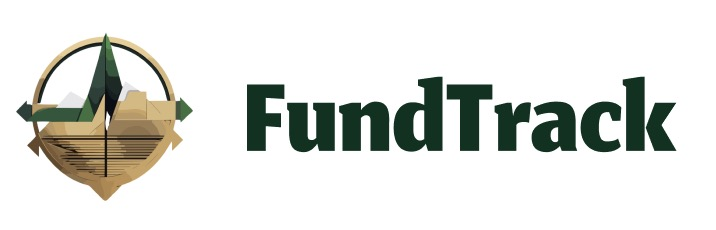

# Capstone Project

> The names and numbers in this README are all madeup.

---

### Table of Contents

- [Capstone Project](#capstone-project)
    - [Table of Contents](#table-of-contents)
  - [Overview](#overview)
      - [Technologies](#technologies)
  - [Description](#description)
  - [Figma design](#figma-design)
  - [Flowchart](#flowchart)
  - [Future enhancements](#future-enhancements)
  - [License](#license)
  - [Author Info](#author-info)

---

## Overview

The Capstone project is the final project required to graduate from the [Introduction to Software Engineering Program](https://www.alxafrica.com/intro-to-software-engineering/) by [ALX Africa](alxafrica.com). 

The aim of this project is for the student to apply the skills and knowledge earned during the program.

#### Technologies
The Capstone project is restricted to the following technologies:
- HTML
- CSS
- Python
- Flask
- MySQL
- JavaScript
- API
- Git

[Back To The Top](#capstone-project)

---

## Description

The ***FundTrack*** web app is a financial app that is used to track assets and liabilities. It uses the basic accounting equation.

[Back To The Top](#capstone-project)

## Figma design
The full figma design showcase for the webapp can be found [here](figma_showcase.md)

[Back To The Top](#capstone-project)

## Flowchart
The flowchart of the webapp:

[Back To The Top](#capstone-project)

## Future enhancements
Plans for the future includes updates in the UI, more customization options, support for more advanced accounting functions and more.

## License

Copyright (c) [2023] [ALX Africa]
Copyright (c) [2023] [Tareq AL-Dhaifani]

[Back To The Top](#capstone-project)

---

## Author Info
For feedback or collab request:
- Tareq AL-Dhaifani
- Email - tareqaldhaifani@gmail.com

[Back To The Top](#capstone-project)
